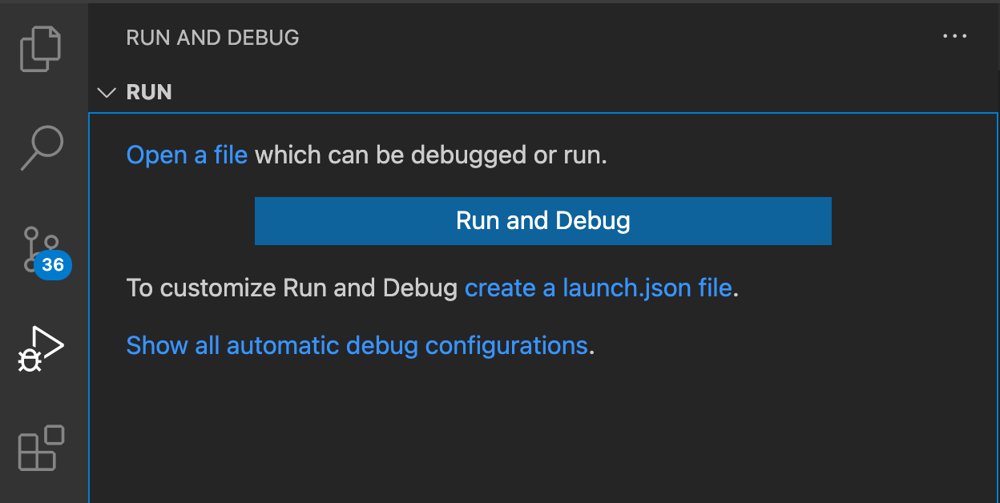
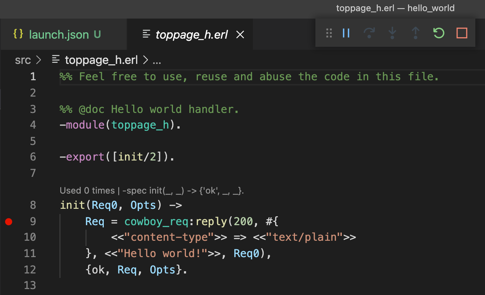
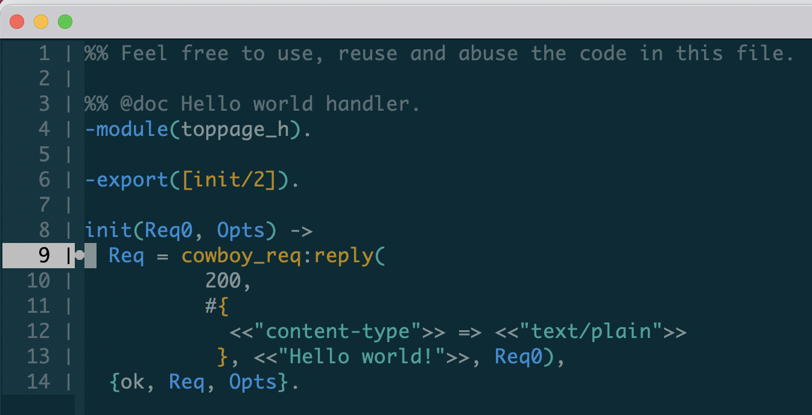
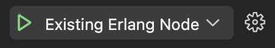
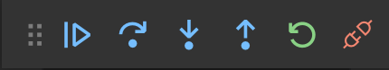
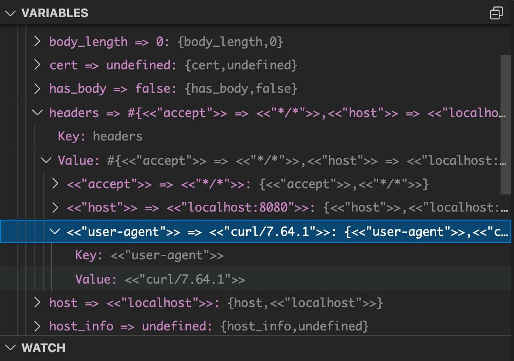
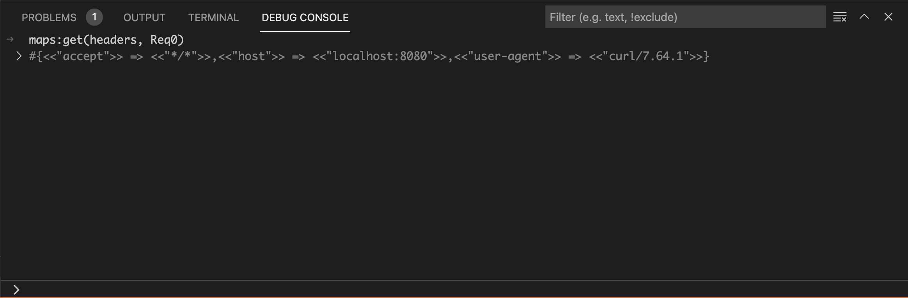
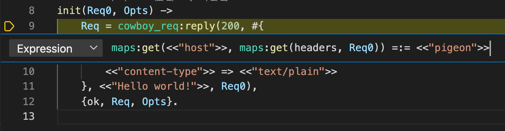
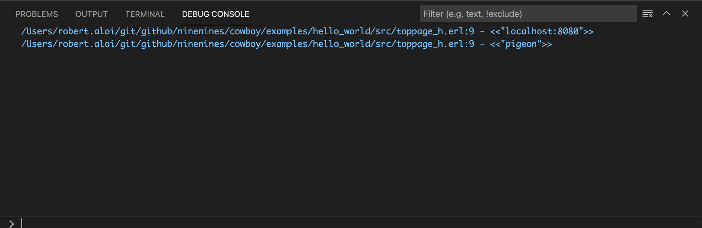

# How To: Use the Debugger

Erlang LS provides debugging functionalities via the [Debug Adapter
Protocol][dap], in short _DAP_. Given the editor-agnostic nature
of the protocol, debugging is available in all text
editors and IDEs which support the _DAP_ protocol. Here is what a
debugging session looks like in Emacs:


The current underlying implementation is based on the [Erlang
interpreter][otp-int] which comes with Erlang/OTP. Incidentally, the
official [OTP Debugger][otp-debugger] is also powered by the same
interpreter.

In this tutorial we will bootstrap a sample project and see how we can
debug our code using Erlang LS.

## Install the debugger

Debugging functionalities are provided in Erlang LS via a separate
executable (an Erlang [escript][escript]) named `els_dap`.

=== "VS Code"

    The executable is bundled with the Erlang LS extension, so it does
    not require any additional installation steps. You can
    configure the Erlang LS extension to use a custom version of the debugger by
    specifying a different _DAP Path_:

    > Extension Settings > DAP Path

=== "Emacs"

    If you are using Emacs, chances are that you are building Erlang LS
    from source. To produce the `els_dap` escript:

    ```bash
    rebar3 as dap escriptize
    ```

    Or simply:

    ```bash
    make
    ```

    You will then find the `els_dap` escript in:

    ```bash
    _build/dap/bin/els_dap
    ```

    Ensure the produced `els_dap` escript resides in a `PATH` known to Emacs.

    The official [dap-mode][dap-mode] package supports Erlang, so
    require both the package and the Erlang plugin:

    ```elisp
    (require 'dap-mode)
    (require 'dap-erlang)
    ```

    You can refer to the official dap-mode [documentation][emacs-dap] for
    more information on how to install and configure the `dap-mode` package
    and its plugins.

## Setup a sample project

To showcase the Erlang LS debugger we will use the [Hello World
example][helloworld] from the Cowboy webserver. Let's start by cloning
the project:

```bash
git clone https://github.com/ninenines/cowboy.git
cd cowboy/examples/hello_world
```

The project uses the [erlang.mk][erlang-mk] build system and the
[relx][relx] release assembler. To be able to use the debugger with
our sample project we will need to apply two small modifications to
the project:

1. Include the Erlang `debugger` as a dependency
2. Tell erlang.mk to symlink the `hello_world` application in the release

To add the `debugger` as a dependency, add the following line to the
project's `Makefile` just before the `include ../../erlang.mk` line:

```Makefile
LOCAL_DEPS = debugger
```

To symlink the application, add the following line to the `relx.config` file:

```erlang
{overrides, [{hello_world, "../hello_world"}]}.
```

We can now lunch our web server:

```bash
make run
```

The above should result in a new Erlang node running in the terminal,
named `hello_world_example@[HOSTNAME]`.

We should now be able to point our browser to `http://localhost:8080`
to see our glorious _Hello world!_ string.

Let's keep the server running. Open a new terminal and proceed with
the following steps.

## Create a launch configuration

We need to tell the debugger how to connect to the running node. We
will do so via a [launch configuration][launch-config].

!!! info "About launch configurations"

    Despite being a _VS Code_ specific concept, launch configurations can
    now be used with multiple text editors and IDEs, including Emacs.

=== "VS Code"

    Navigate to the _Run and Debug_ panel and click on _Create a launch.json file_
    link and select the _Erlang OTP Debugger_ option.

    

    This will create a file
    in `.vscode/launch.json`. Replace the content of the file with the following one:

    ```json
    {
        "version": "0.2.0",
        "configurations": [
            {
                "name": "Existing Erlang Node",
                "type": "erlang",
                "request": "attach",
                "projectnode": "hello_world_example",
                "cookie": "hello_world_example",
                "timeout": 300,
                "cwd": "${workspaceRoot}"
            }
        ]
    }
    ```

=== "Emacs"

    We need to create a file named `launch.json` in the top-level
    directory of the project. In our case, the file will reside in
    `cowboy/examples/hello_world/launch.json`:

    ```json
    {
        "version": "0.2.0",
        "configurations": [
            {
                "name": "Existing Erlang Node",
                "type": "erlang",
                "request": "attach",
                "projectnode": "hello_world_example",
                "cookie": "hello_world_example",
                "timeout": 300
            }
        ]
    }
    ```

## Add a breakpoint

=== "VS Code"

    Access the `src/toppage_h.erl` file and add a breakpoint by clicking
    next to the line number corresponding to the first line of the
    `init/2` function body.

    

=== "Emacs"

    Navigate to the `src/toppage_h.erl`, move to the first line of the
    `init/2` function body and run:

    ```elisp
    M-x dap-breakpoint-add
    ```

    

## Start a debugging session

=== "VS Code"

    Select the _Run and Debug_ panel, select _Existing Erlang Node_ from
    the dropdown and press the `play` button:

    

    Open a new terminal and use the `curl` command to trigger our new
    breakpoint.

    ```bash
    curl -i http://localhost:8080

    HTTP/1.1 200 OK
    content-length: 12
    content-type: text/plain
    date: Fri, 09 Jul 2021 13:35:01 GMT
    server: Cowboy

    Hello world!
    ```

    Execution will be paused on the breakpoint. You can then use the standard VS
    Code controls to control execution:

    

    On the left hand side it is possible to explore the call stack and the
    variable bindings. For example, we can incrementally expand the
    bindings for the Cowboy input request and verify the value for the
    _User Agent_ header:

    

    The _Debug Console_ at the bottom can be used as a _REPL_ with the
    current variable bindings available:

    

    The _Watch List_ on the left can be used to track the value of a
    specific variable (for example, the `Opts` variable):

    

    And the _Debug Console_ to manipulate those values:

    

    VS Code offers extensive debugging functionalities. For more information
    please refer to the [official VS Code documentation][vscode-debugging].

=== "Emacs"

    Open the `src/toppage_h.erl` buffer and run:

    ```
    M-x dap-debug
    ```

    You will get prompted for a _configuration template_. Select _Existing
    Erlang Node_.

    Open a new terminal and use the `curl` command to trigger our new
    breakpoint.

    ```bash
    curl -i http://localhost:8080

    HTTP/1.1 200 OK
    content-length: 12
    content-type: text/plain
    date: Fri, 09 Jul 2021 13:35:01 GMT
    server: Cowboy

    Hello world!
    ```

    Execution will be paused on the breakpoint. You can then use the standard Emacs
    controls to control execution:

    

    On the right hand side it is possible to explore the call stack and the
    variable bindings. For example, we can incrementally expand the
    bindings for the Cowboy input request and verify the value for the
    _User Agent_ header:

    

    You can also open a _REPL_ with the current variable bindings available:

    ```elisp
    M-x dap-eval
    ```

    The `dap-mode` package offers extensive debugging functionalities. For more information
    please refer to the [official documentation][emacs-dap].

!!! warning "Debugging and concurrency"

    Due to the nature of Erlang processes, debugging a concurrent system
    could be tricky. As an example, a breakpoint could cause an internal
    timeout to occur and cause a crash as a consequence. Therefore,
    Erlang processes may require to be properly isolated or protected during
    a step-by-step debugging session.

## Special Breakpoint Types

The _DAP_ protocol describes a variety of breakpoint types which can
be used in different situations:

* Conditional breakpoints
* Logpoints
* Hitpoints

### Conditional Breakpoints

_Conditional breakpoints_ are only triggered whenever a given
condition evaluates to `true`. For example, we may want execution to
break only when the value of the _Host_ header passed by the client
contains the string _pigeon_:

=== "VS Code"

    To setup a conditional breakpoint, right-click next to a line number
    and select the _Add a conditional breakpoint..._ option. Add the following _expression_:

    ```erlang
    maps:get(<<"host">>, maps:get(headers, Req0)) =:= <<"pigeon">>
    ```

    

=== "Emacs"

    To add a conditional breakpoint, move to an existing breakpoint, then run:

    ```elisp
    M-x dap-breakpoint-condition
    ```

    And add the following _expression_:

    ```erlang
    maps:get(<<"host">>, maps:get(headers, Req0)) =:= <<"pigeon">>
    ```

With the above conditional breakpoint set, the following request will
not cause execution to break:

```bash
curl -i http://localhost:8080
```

But the following will:

```bash
curl -H "Host: pigeon" -i http://localhost:8080
```

### Logpoints

_Logpoints_ are a special type of breakpoint which do not cause
execution to break, but they result in a log message to be printed out
in the _Debug Console_.

=== "VS Code"

    To log the _Host_ header on every request, right-click next to the
    line number and select the _Add logpoint..._ option. Add the following _Log Message_:

    ```bash
    maps:get(<<"host">>, maps:get(headers, Req0))
    ```

    Let's trigger a few requests with different (or default) host headers:

    ```bash
    curl -i http://localhost:8080
    curl -H "Host: pigeon" -i http://localhost:8080
    ```

    We can then follow the _logpoints_ in the debug console:

    

=== "Emacs"

    To log the _Host_ header on every request, move to an existing breakpoint, then run:

    ```bash
    M-x dap-breakpoint-log-message
    ```

    Add the following _Log Message_:

    ```bash
    maps:get(<<"host">>, maps:get(headers, Req0))
    ```

    Let's trigger a few requests with different (or default) host headers:

    ```bash
    curl -i http://localhost:8080
    curl -H "Host: pigeon" -i http://localhost:8080
    ```

    To follow the _logpoints_, run:

    ```elisp
    M-x dap-go-to-output-buffer
    ```

    

### Hitpoints

_Hitpoints_ are a special kind of breakpoint which are triggered every
_Nth_ time.

=== "VS Code"

    Select an existing breakpoint and choose the _Hit Count_ option from the dropdown.
    Specify a number _N_. The respective breakpoint will be triggered every _Nth_ time.

=== "Emacs"

    Navigate to an existing breakpoint. Run:

    ```elisp
    M-x dap-breakpoint-hit-condition
    ```

    Specify a number _N_. The respective breakpoint will be triggered every _Nth_ time.

## Troubleshooting

If something does not work as expected, have a look to the Erlang LS
DAP logs. They will most likely point you to the root cause of the issue.
Logs are available at:

```bash
[USER_LOG_DIR]/[PROJECT_NAME]/dap_server.log
```

Where `[USER_LOG_DIR]` is the output of:

```erlang
filename:basedir(user_log, "els_dap").
```

For example, on Mac OS, the DAP logs for the _hello\_world_ project will be in:

```bash
/Users/[USERNAME]/Library/Logs/els_dap/hello_world/dap_server.log
```

If the DAP logs do not help, feel free to reach out on [GitHub][github] or [Slack][slack].

Happy debugging with Erlang LS!

[dap]:https://microsoft.github.io/debug-adapter-protocol/
[otp-debugger]:http://erlang.org/doc/apps/debugger/debugger_chapter.html
[otp-int]:http://erlang.org/doc/man/int.html
[helloworld]:https://github.com/ninenines/cowboy/tree/master/examples/hello_world
[launch-config]:https://code.visualstudio.com/docs/editor/debugging#_launch-configurations
[erlang-mk]:https://erlang.mk
[relx]:https://erlware.github.io/relx/
[vscode-debugging]:https://code.visualstudio.com/docs/editor/debugging
[escript]:https://erlang.org/doc/man/escript.html
[dap-mode]:https://github.com/emacs-lsp/dap-mode
[emacs-dap]:https://emacs-lsp.github.io/dap-mode/
[github]:https://github.com/erlang-ls/erlang_ls/issues/new/choose
[slack]:https://klarna.slack.com/app_redirect?channel=erlang-ls
