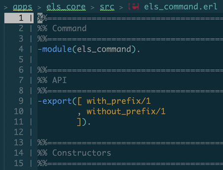
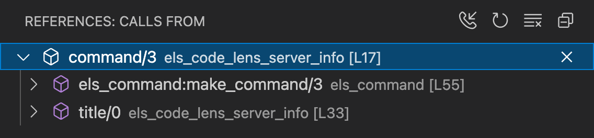
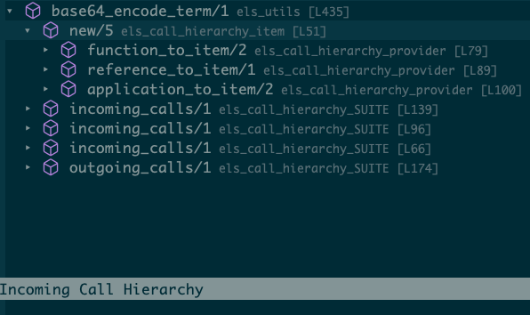

# Features

## Breadcrumbs

Breadcrumbs display a list of links to the current element and its
ancestors in the top part of the page.



=== "VS Code"

    Breadcrumbs can be enabled or disabled via:

    > Settings > Workbench > Breadcrumbs

    The settings section contains a number of additional preferences to
    tweak what to display exactly (e.g. icons, symbols, complete path to
    the file, etc).

=== "Emacs"

    Breadcrumbs are provided by the
    [lsp-mode](https://emacs-lsp.github.io/lsp-mode) package.
    To enable breadcrumbs:

    ```elisp
    (setq lsp-headerline-breadcrumb-mode t)
    ```

    You can also customize what to display in the breadcrumbs by
    customizing the `lsp-headerline-breadcrumb-segments` variable. For
    more information please refer to the official [lsp-mode
    documentation](https://emacs-lsp.github.io/lsp-mode/page/main-features/#breadcrumb-on-headerline).

## Code Completion

Get context-aware code completions for function names, macros,
records, variable names and more.


## Go To Definition

Navigate to the definition of a function, macro, record or type.


## Go To Implementation for OTP Behaviours

Hovering a `gen_server:start_link` call? Jump to the respective `init`
function with a single keystroke.


## Signature Suggestions

Never remember the order of the `lists:keytake/3` arguments? You are
not alone. We got you covered.


## Compiler Diagnostics

Display warnings and errors from the compiler. Inline.


## Dialyzer Diagnostics

It has never been so easy to make Dialyzer happy.


## Elvis Diagnostics

Display [Elvis](https://github.com/inaka/elvis) style suggestions
inline. No more nit-picking comments from colleagues!


## Edoc

Hover a local or remote function to see its `edoc`. You will miss this
feature so much when edocs are not available that you will start
writing them!


## Navigation for Included Files

Navigate to included files with a single click.


## Find/Peek References

Who is calling this function? Figure it out without leaving the
current context.


## Outline

Get a nice outline of your module on the side and jump between
functions.


## Workspace Symbols

Jump to the module you're looking for, in no time.


## Folding

Focus on what's important, fold the rest.


## Snippets

Quickly insert parametrized, reusable pieces of code.


## Suggest Type Specs

Annotate your Erlang programs with type information.


## Call Hierarchy

The _Call Hierarchy_ feature lets you explore callers of a given
function (known as _incoming calls_), as well as show which functions
are called by a given function (known as _outgoing calls_).

For an overview of what Call Hierarchy may look like, have a look to
this [video](https://www.youtube.com/watch?v=r5LA7ivUb2c).

=== "VS Code"

    

    To display the _Call Hierarchy_ panel, right-click on the name of a
    function and select _Show Call Hierarchy_. You can use the newly
    opened panel to navigate through the hierarchy of calls.

    To switch between _incoming calls_ and _outgoing calls_ simply use the
    _phone_ icon on the top-right corner of the panel.

=== "Emacs"

    

    The feature is provided by the
    [lsp-treemacs](https://github.com/emacs-lsp/lsp-treemacs) package.

    To show the _incoming calls_ hierarchy:

        M-x lsp-treemacs-call-hierarchy

    To show the outgoing calls hierarchy:

        C-u M-x lsp-treemacs-call-hierarchy

    For more information please refer to the official [lsp-treemacs
    documentation](https://github.com/emacs-lsp/lsp-treemacs#lsp-treemacs-call-hierarchy).

## Code Actions

Code Actions are a mechanism providing the user with possible
corrective actions right next to an error or warning. If actions are
available, a light bulb or similar icon appears next to the error or
warning. When the user clicks the light bulb (or hits a shortcut), a
list of available code actions is presented.

Currently Erlang LS support code actions for:

* Exporting unused functions
* Prepending an underscore (`_`) to an unused variable
* Correct a mistyped name for an unbound variable
* Fix a module name to match the corresponding filename
